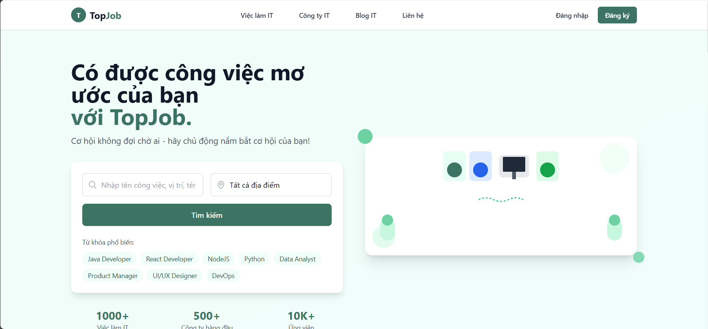
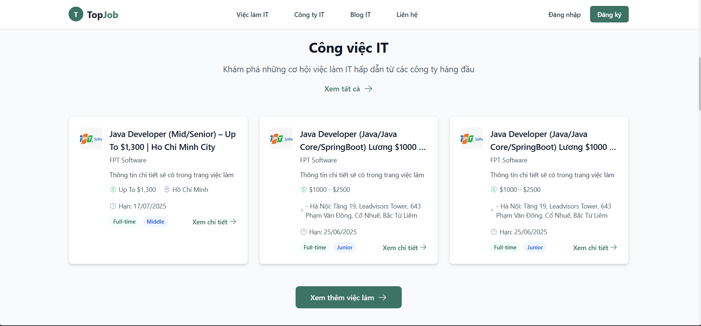
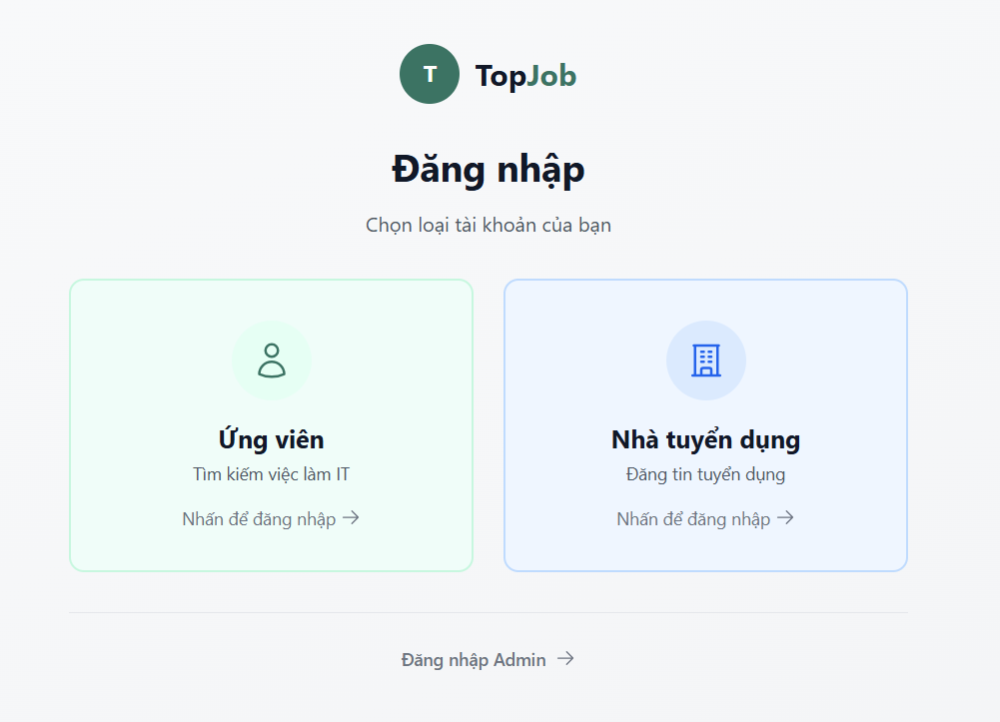
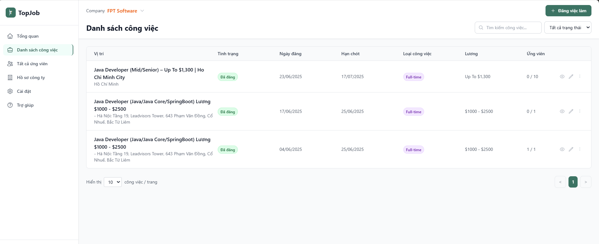
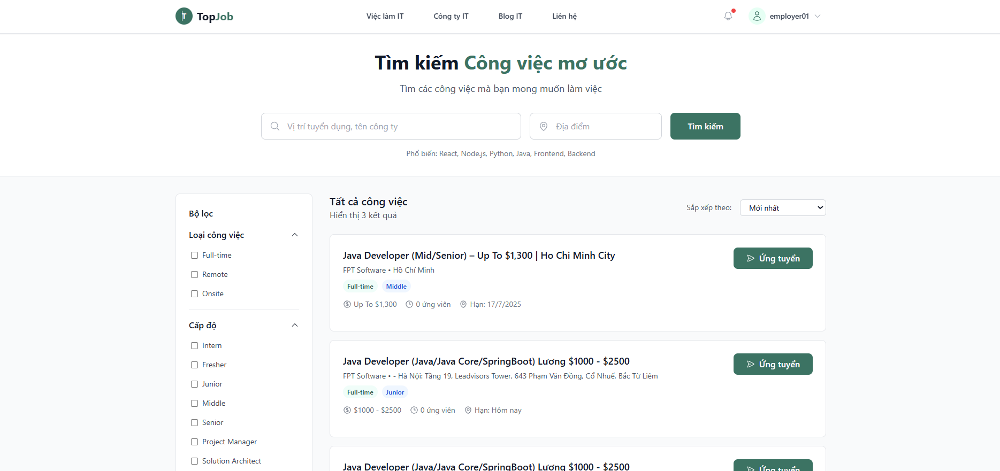
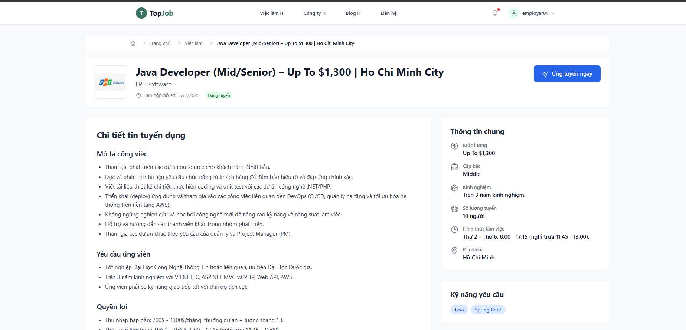
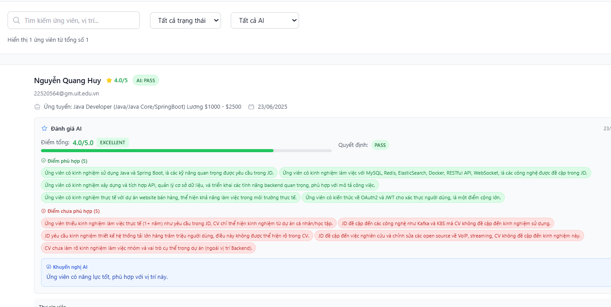
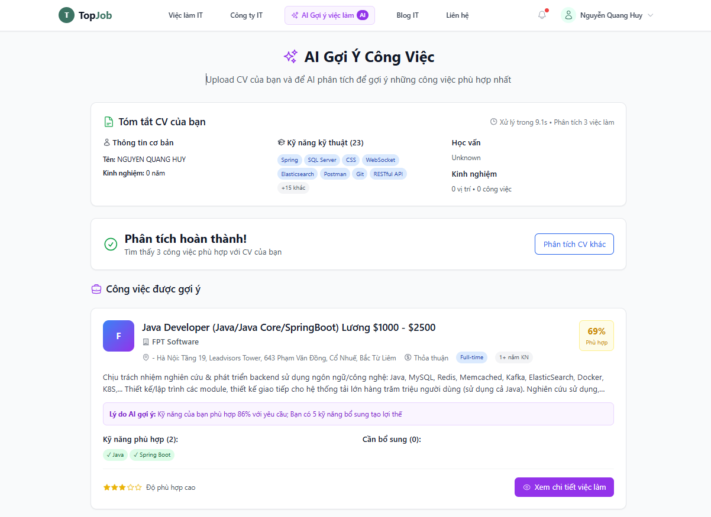
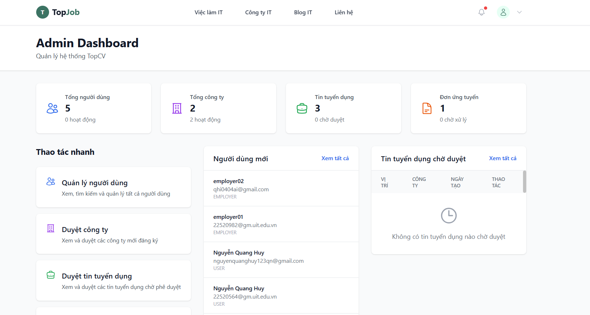

# 🚀 TopJob - Hệ thống Tuyển dụng Thông minh

[](https://openjdk.org/)
[](https://spring.io/projects/spring-boot)
[](https://reactjs.org/)
[](https://www.typescriptlang.org/)
[](https://www.python.org/)
[](https://fastapi.tiangolo.com/)
[](https://www.postgresql.org/)
[](https://redis.io/)

## 📋 Mô tả dự án

TopJob là một hệ thống tuyển dụng thông minh tích hợp AI, cung cấp giải pháp toàn diện cho việc kết nối ứng viên và nhà tuyển dụng. Hệ thống bao gồm:

- **Frontend**: Giao diện người dùng hiện đại với React + TypeScript
- **Backend**: API RESTful với Spring Boot + Java 21
- **AI Service**: Hệ thống AI phân tích CV và gợi ý công việc với Python + FastAPI
- **Database**: PostgreSQL cho dữ liệu chính và Redis cho cache

## 🖼️ Demo


### 🏠 Trang chủ



*Giao diện trang chủ với thiết kế hiện đại và responsive*

### 🔐 Đăng nhập/Đăng ký


*Hệ thống xác thực an toàn với OTP và JWT*

### 📊 Dashboard


*Dashboard cá nhân với thống kê ứng tuyển và gợi ý công việc*



*Dashboard công ty với quản lý tin tuyển dụng và ứng viên*

### 💼 Tìm kiếm công việc


*Tìm kiếm công việc thông minh với bộ lọc nâng cao*

### 🏢 Chi tiết công việc


*Thông tin chi tiết công việc*

### 🤖 AI Features


*Phân tích CV tự động với AI*



*Gợi ý công việc phù hợp dựa trên AI*

### ⚙️ Admin Panel


*Bảng điều khiển quản trị hệ thống*

---

## ✨ Tính năng chính

### 👥 Cho ứng viên
- Đăng ký/đăng nhập tài khoản
- Tạo và quản lý CV chuyên nghiệp
- Tìm kiếm công việc thông minh với AI
- Nhận gợi ý công việc phù hợp
- Theo dõi trạng thái ứng tuyển
- Lưu trữ công việc yêu thích
- Review công ty
- Ứng tuyển các công việc, uploadCV.

### 🏢 Cho nhà tuyển dụng
- Đăng ký/đăng nhập tài khoản công ty
- Đăng tin tuyển dụng
- Quản lý hồ sơ ứng viên
- AI screening CV tự động
- Phân tích và thống kê ứng viên
- Quản lý thông tin công ty

### 🔧 Cho Admin
- Quản lý người dùng và công ty
- Quản lý danh mục công việc
- Phân tích dữ liệu tổng quan
- Quản lý hệ thống

### 🤖 AI Features
- **CV Analysis**: Phân tích và trích xuất thông tin từ CV
- **Job Matching**: Gợi ý công việc phù hợp dựa trên kỹ năng và kinh nghiệm
- **Smart Screening**: Đánh giá tự động ứng viên cho vị trí công việc
- **Skill Extraction**: Trích xuất và phân loại kỹ năng từ CV
- **Semantic Search**: Tìm kiếm ngữ nghĩa cho công việc và ứng viên

## 🏗️ Kiến trúc hệ thống

```
TopCV/
├── frontend/                 # React + TypeScript Frontend
│   ├── src/
│   │   ├── components/      # React components
│   │   │   ├── common/      # Common components
│   │   │   ├── layout/      # Layout components
│   │   │   ├── home/        # Home page components
│   │   │   ├── job/         # Job related components
│   │   │   └── company/     # Company related components
│   │   ├── pages/           # Page components
│   │   │   ├── admin/       # Admin pages
│   │   │   ├── employer/    # Employer pages
│   │   │   ├── user/        # User pages
│   │   │   └── Auth/        # Authentication pages
│   │   ├── services/        # API services
│   │   │   └── api/         # API endpoints
│   │   ├── contexts/        # React contexts
│   │   ├── types/           # TypeScript types
│   │   └── styles/          # CSS styles
│   ├── package.json
│   └── tsconfig.json
├── recommend_screening4/    # Python AI Service
│   └── recommend_screening/
│       ├── core/            # Core AI logic
│       │   ├── extract_cv.py # CV extraction
│       │   ├── recommen_engine.py # Recommendation engine
│       │   └── screening_cv.py # CV screening
│       ├── models/          # Data models
│       ├── router/          # FastAPI routes
│       ├── template_prompt/ # AI prompts
│       ├── config.py        # Configuration
│       ├── run_server.py    # Server startup
│       └── requirements.txt # Python dependencies
└── TopCV/Backend/          # Spring Boot Backend
    └── src/main/java/com/TopCV/
        ├── controller/      # REST controllers
        ├── service/         # Business logic
        │   └── impl/        # Service implementations
        ├── repository/      # Data access layer
        ├── entity/          # JPA entities
        ├── dto/             # Data Transfer Objects
        │   ├── request/     # Request DTOs
        │   └── response/    # Response DTOs
        ├── mapper/          # Object mappers
        ├── configuration/   # Spring configurations
        ├── exception/       # Exception handling
        └── enums/           # Enumerations
```

## 🛠️ Yêu cầu hệ thống

### Backend (Java)
- **Java**: JDK 21+
- **Maven**: 3.8+
- **PostgreSQL**: 13+
- **Redis**: 6+

### Frontend (React)
- **Node.js**: 18+
- **npm**: 9+

### AI Service (Python)
- **Python**: 3.8+
- **pip**: 20+

## 📦 Cài đặt và chạy dự án

### 1. Clone repository
```bash
git clone <repository-url>
cd TopCV
```

### 2. Cài đặt Database

#### PostgreSQL
```bash
# Tạo database
createdb TopCV

# Hoặc sử dụng psql
psql -U postgres
CREATE DATABASE TopCV;
```

#### Redis
```bash
# Ubuntu/Debian
sudo apt-get install redis-server

# macOS
brew install redis

# Windows
# Tải Redis từ https://redis.io/download
```

### 3. Cấu hình Environment Variables

Tạo file `.env` trong thư mục gốc:
```env
# Database
DATABASE_URL=jdbc:postgresql://localhost:5432/TopCV
DB_USERNAME=admin
DB_PASSWORD=root

# Redis
REDIS_HOST=localhost
REDIS_PORT=6379

# JWT
JWT_SIGNER_KEY=your-secret-key-here

# Email (Gmail)
MAIL_USERNAME=your-email@gmail.com
MAIL_PASSWORD=your-app-password

# Google AI
GOOGLE_API_KEY=your-google-api-key

# App
APP_NAME=TopCV
APP_URL=http://localhost:8080/TopCV
```

### 4. Chạy Backend (Spring Boot)

```bash
cd recommend_screening4/TopCV/Backend

# Cài đặt dependencies
mvn clean install

# Chạy ứng dụng
mvn spring-boot:run
```

Backend sẽ chạy tại: `http://localhost:8080/TopCV`

### 5. Chạy AI Service (Python)

```bash
cd recommend_screening4/recommend_screening

# Tạo virtual environment
python -m venv venv

# Kích hoạt virtual environment
# Windows
venv\Scripts\activate
# macOS/Linux
source venv/bin/activate

# Cài đặt dependencies
pip install -r requirements.txt

# Chạy AI service
python run_server.py
```

AI Service sẽ chạy tại: `http://localhost:8000`

### 6. Chạy Frontend (React)

```bash
cd frontend

# Cài đặt dependencies
npm install

# Chạy development server
npm start
```

Frontend sẽ chạy tại: `http://localhost:3000`

## 🔧 Cấu hình chi tiết

### Backend Configuration
File: `recommend_screening4/TopCV/Backend/src/main/resources/application.yml`

```yaml
server:
  port: 8080
  servlet:
    context-path: /TopCV

spring:
  datasource:
    url: jdbc:postgresql://localhost:5432/TopCV
    username: admin
    password: root
  data:
    redis:
      host: localhost
      port: 6379
```

### AI Service Configuration
File: `recommend_screening4/recommend_screening/config.py`

```python
class Config:
    GOOGLE_API_KEY = os.getenv("GOOGLE_API_KEY")
    SENTENCE_TRANSFORMER_MODEL = "all-MiniLM-L6-v2"
    LLM_MODEL = "gemini-2.0-flash"
```

## 📚 API Documentation

### Backend APIs
- **Swagger UI**: `http://localhost:8080/TopCV/swagger-ui.html`
- **API Base URL**: `http://localhost:8080/TopCV/api/v1`

### AI Service APIs
- **FastAPI Docs**: `http://localhost:8000/docs`
- **ReDoc**: `http://localhost:8000/redoc`
- **Health Check**: `http://localhost:8000/health`

## 🧪 Testing

### Backend Tests
```bash
cd recommend_screening4/TopCV/Backend
mvn test
```

### Frontend Tests
```bash
cd frontend
npm test
```

### AI Service Tests
```bash
cd recommend_screening4/recommend_screening
python -m pytest
```

## 🚀 Deployment

### Production Build

#### Frontend
```bash
cd frontend
npm run build
```

#### Backend
```bash
cd recommend_screening4/TopCV/Backend
mvn clean package -DskipTests
```

#### AI Service
```bash
cd recommend_screening4/recommend_screening
pip install -r requirements.txt
python run_server.py --host 0.0.0.0 --port 8000
```

## 📁 Cấu trúc thư mục chi tiết

```
TopCV/
├── frontend/                          # React Frontend
│   ├── public/                        # Static files
│   ├── src/
│   │   ├── components/               # Reusable components
│   │   │   ├── common/              # Common components
│   │   │   ├── layout/              # Layout components
│   │   │   ├── home/                # Home page components
│   │   │   ├── job/                 # Job related components
│   │   │   └── company/             # Company related components
│   │   ├── pages/                   # Page components
│   │   │   ├── admin/              # Admin pages
│   │   │   ├── employer/           # Employer pages
│   │   │   ├── user/               # User pages
│   │   │   └── Auth/               # Authentication pages
│   │   ├── services/               # API services
│   │   │   └── api/               # API endpoints
│   │   ├── contexts/              # React contexts
│   │   ├── types/                 # TypeScript types
│   │   └── styles/                # CSS styles
│   ├── package.json
│   └── tsconfig.json
├── recommend_screening4/            # Python AI Service
│   └── recommend_screening/
│       ├── core/                   # Core AI logic
│       │   ├── extract_cv.py      # CV extraction
│       │   ├── recommen_engine.py # Recommendation engine
│       │   └── screening_cv.py    # CV screening
│       ├── models/                # Data models
│       ├── router/                # FastAPI routes
│       ├── template_prompt/       # AI prompts
│       ├── config.py             # Configuration
│       ├── run_server.py         # Server startup
│       └── requirements.txt      # Python dependencies
├── TopCV/Backend/                # Spring Boot Backend
│   └── src/main/java/com/TopCV/
│       ├── controller/           # REST controllers
│       ├── service/             # Business logic
│       │   └── impl/           # Service implementations
│       ├── repository/         # Data access layer
│       ├── entity/            # JPA entities
│       ├── dto/              # Data Transfer Objects
│       │   ├── request/      # Request DTOs
│       │   └── response/     # Response DTOs
│       ├── mapper/          # Object mappers
│       ├── configuration/   # Spring configurations
│       ├── exception/       # Exception handling
│       └── enums/          # Enumerations
└── docs/                    # Documentation
    ├── images/             # Demo images
    │   ├── home/          # Home page screenshots
    │   ├── auth/          # Authentication screenshots
    │   ├── dashboard/     # Dashboard screenshots
    │   ├── jobs/          # Job pages screenshots
    │   ├── companies/     # Company pages screenshots
    │   ├── mobile/        # Mobile screenshots
    │   ├── ai/            # AI features screenshots
    │   └── admin/         # Admin panel screenshots
    ├── DEMO_IMAGES_GUIDE.md    # Guide for adding demo images
    └── PLACEHOLDER_GUIDE.md    # Guide for creating placeholder images
```